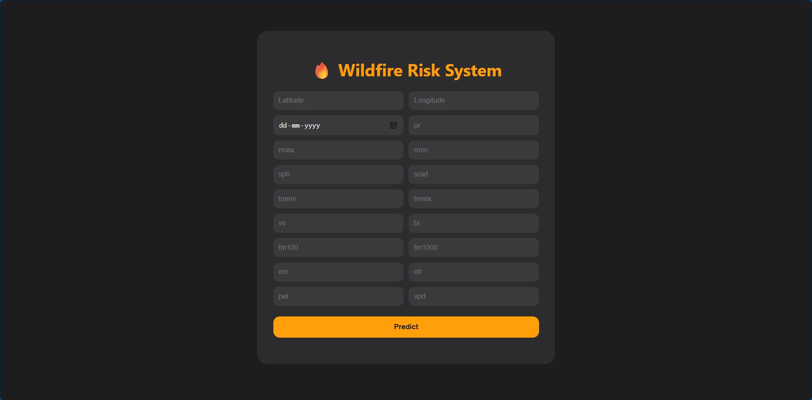

# WildFire Risk System

Wildfires are one of the most destructive natural disasters, causing massive ecological, economic, and social impacts globally. They not only destroy forests, wildlife habitats, and agricultural lands, but also pose serious threats to human lives and property. Increasingly, climate change, prolonged droughts, and extreme weather conditions have intensified the frequency and severity of wildfires, making early detection and risk assessment more critical than ever.

The **WildFire Risk System** is developed to address this urgent need by providing a predictive framework for assessing wildfire risks in real-time. The system leverages a combination of environmental, meteorological, and geospatial data to predict areas of high fire susceptibility. It integrates machine learning models, modular pipelines, and asynchronous processing to ensure scalable, efficient, and accurate risk analysis.

The motivation behind choosing this problem statement stems from the **growing global concern over wildfires** and their devastating consequences on ecosystems, human populations, and the economy. Traditional approaches to wildfire management often rely on reactive measures, which are limited in effectiveness and timeliness. By contrast, predictive modeling and data-driven risk assessment allow authorities to take **proactive steps**, such as targeted resource allocation, early warnings, and preventive interventions.

This project combines **industry-level modular components and pipelines**, modern Python frameworks like **FastAPI** for real-time APIs, **Pydantic** for robust data validation and type enforcement, and asynchronous uvicorn server. It is designed not just as a research tool, but as a practical, scalable system that can support decision-making in real-world wildfire management scenarios.

## Disclaimer

While the **WildFire Risk System** demonstrates the use of industry-level tools, modular pipelines, and modern Python frameworks, it is important to note that this project is **primarily a learning and research initiative**. I am a student, and this system was created for my **personal interest and educational purposes**.  

This project is not a production-ready or fully validated wildfire prediction system. It has limitations and may not provide accurate or actionable risk assessments in real-world scenarios. The models and pipelines are intended to **demonstrate concepts, data handling, asynchronous processing, and modular design** rather than replace professional tools used by authorities or researchers in wildfire management.

Key objectives of the WildFire Risk System include:

- **Early Detection:** Identify high-risk areas before fires start, enabling proactive interventions.
- **Risk Assessment:** Quantify the likelihood of wildfires based on multiple environmental and meteorological factors.
- **Scalability:** Modular design and asynchronous processing ensure the system can handle large datasets and real-time analysis.
- **Actionable Insights:** Provide authorities, researchers, and communities with insights that inform decision-making and resource allocation.

By combining data science, predictive modeling, and modern software engineering practices, the WildFire Risk System aims to reduce the devastating impacts of wildfires and support **sustainable management of natural resources and human safety**.

---

## Features

- **Predictive Modeling:** Assess wildfire risk based on multiple environmental and weather factors.
- **Modular Pipelines:** Industry-level, reusable, and scalable components for data processing and modeling.
- **Asynchronous Processing:** High-performance async pipelines for faster computation and API responses.
- **REST API Integration:** Powered by **FastAPI** for serving predictions and risk assessments in real-time.
- **Data Validationand Type enforcement:** Uses **Pydantic** for robust data validation and type safety.
- **Visualization & Analysis:** Interactive notebooks for exploratory data analysis and results visualization.
- **Handles Large Files:** Efficient management of large datasets and machine learning models using **Git LFS**.

---
